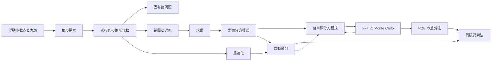

# まえがき

これは読むための半分である。もう半分はリポジトリ直下の `src/` の crate で、そこに実装が入る。

## この本が何を書き、何を書かないか

数値解析の教科書は数学を書く。Rust の教科書は言語を書く。この本が埋めようとしているのは
その間で、**「この数学的事実が、Rust のどの言語機構と噛み合うのか」**という接続である。

たとえば[浮動小数点と丸め](ch00-float.md)でこういう話をする。浮動小数点の比較は全順序ではない——NaN があるからで、
これは数学的な事実である。Rust ではその事実が `f64: PartialOrd` かつ `f64: !Ord` という
**型として**現れていて、だから `Vec<f64>` に `.sort()` が生えない。数学の側の事実と
言語の側の制約が同じものの表と裏になっている。そういう接続を各章で拾う。

書かないものが2つある。

**設計判断の結論を書かない。** 各章の終わりに「この章で決めること」という節があり、
そこには問いだけが並んでいる。関数を `impl Fn` で受けるか `&dyn Fn` か、
スカラーを `f64` 固定にするか generic にするか——選択肢と、それぞれが何を天秤にかけているかは
書くが、どれを採るかは書かない。ここが唯一の未知だからである。数学は既に知っているものとして扱う。

**実装とテストを書かない。** アルゴリズムは数式と手順で書く。Rust のコードとしては書かない。
コード片が本に載っていると、それが答えになってしまい、設計を自分で外す機会が消える。
本に載る Rust コードは、言語機構を説明するための断片（`f64::total_cmp` が何を返すか、など）に限る。

**オラクルは書く。** 「この入力での正解は 0.7390851332151607」は答えを教えるが、
`fn newton(...)` がどういう型を取るべきかは何も決めない。検証済みの値は各章に埋めてある。

**証明も書かない。** 固有名詞の付いた結果（Butcher の障壁、Dahlquist の第2障壁、
Lax の同値定理、Koksma–Hlawka の不等式、Céa の補題……）は主張と使い方だけを書く。
証明は[参考文献](references.md)から辿る——章ごとに3〜5点に絞ってある。

数分で解ける確認問題は[演習問題](exercises.md)にまとめた。各章の「完了条件」が
数時間〜数日の実装課題なので、その手前の粒度が要る。実装前に解くと、
実装中に何を疑えばよいかが分かる。

## 読み方

点線は逆向き——**後ろの章に依存している**。2本とも[確率微分方程式](ch04b-sde.md)に入り、
[FFT と Monte Carlo](ch07-fft-mc.md)とは相互依存になる。

- **FFT と Monte Carlo からは必須。** 弱収束の実測は Monte Carlo の統計誤差の扱いを要求するので、
  あちらを読んでから[確率微分方程式](ch04b-sde.md)の完了条件に戻る。強収束のほうは Monte Carlo なしで測れる
- **[自動微分](ch06-autodiff.md)からは任意。** Milstein に要る \\(\partial b/\partial x\\) は手書きでも数値微分でも済む

矢印が出ていない章は、後の章がそれを前提にしないというだけである。
[固有値問題](ch02b-eigen.md)は[密行列の線形代数](ch02-linalg.md)が条件数の計算法を送っている先で、飛ばす章ではない。

下の表は**本文で明示的に前章を呼んでいる箇所**。

| 章 | 依存先 | 何を使うか |
|---|---|---|
| [根の探索](ch01-roots.md) | 浮動小数点と丸め | 誤差比較の絶対/相対、Horner と評価順、桁落ち |
| [密行列の線形代数](ch02-linalg.md) | 根の探索 | 反復法は不動点反復の行列版 |
| [固有値問題](ch02b-eigen.md) | 根の探索・密行列の線形代数 | 反復の停止条件 / Householder と QR / 「逆行列は作らない」 |
| [補間と近似](ch02c-interp.md) | 根の探索・密行列の線形代数 | 節点重複の失敗をどう返すか / スプラインが三重対角系に落ちる |
| [求積](ch03-quad.md) | 浮動小数点と丸め・根の探索・補間と近似 | 補償付き総和 / Gauss 節点は Legendre 多項式の根 / 補間誤差が求積誤差になる |
| [常微分方程式](ch04-ode.md) | 根の探索・密行列の線形代数・求積 | 陰的解法が Newton を呼び、その内側で線形方程式を解く。局所と大域の次数のずれ |
| [確率微分方程式](ch04b-sde.md) | 常微分方程式・**自動微分**・**FFT と Monte Carlo** | Milstein の \\(\partial b/\partial x\\) / 弱収束の実測に Monte Carlo |
| [最適化](ch05-optim.md) | 根の探索・密行列の線形代数 | 多変数 Newton / 線形方程式（勾配の入手は[自動微分](ch06-autodiff.md)で回収する） |
| [自動微分](ch06-autodiff.md) | 浮動小数点と丸め・根の探索・常微分方程式・最適化 | FMA と bit 一致 / 導関数の渡し方の回収 / 感度解析 / 完了条件が Rosenbrock |
| [FFT と Monte Carlo](ch07-fft-mc.md) | 浮動小数点と丸め・密行列の線形代数・求積・確率微分方程式 | FMA / `split_at_mut` / 次元の呪い / RNG 注入の設計 |
| [PDE の差分法](ch08-pde.md) | 密行列の線形代数・常微分方程式・FFT と Monte Carlo | 線の方法が ODE に帰着。Lax の同値定理が Parseval を経由 |
| [有限要素法](ch08b-fem.md) | 浮動小数点と丸め・密行列の線形代数・補間と近似・求積・常微分方程式・自動微分・PDE の差分法 | 並列総和の再現性 / CG と Cholesky / 補間誤差 / \\(L^2\\) 誤差の求積 / 時間積分 / メッシュの所有権 / von Neumann 安定性と CFL |

**[固有値問題](ch02b-eigen.md)と[補間と近似](ch02c-interp.md)は「[密行列の線形代数](ch02-linalg.md)の一部」ではない。**
目次で隣り合っているだけで、固有値問題はその道具立てをそのまま使う独立した題材、
補間と近似は[求積](ch03-quad.md)の前提として置いてある。

とくに繋がりが強い組み合わせがある。**[自動微分](ch06-autodiff.md)と[有限要素法](ch08b-fem.md)は同じ問題**（相互参照するグラフの所有権）を
同じ道具（arena / インデックス方式）で解く。そして**[密行列の線形代数](ch02-linalg.md)の共役勾配法は
[有限要素法](ch08b-fem.md)で matrix-free として書き直される**——そこで初めて、CG が行列ではなく
行列ベクトル積しか要求しないという事実がトレイトとして表現される。

## リポジトリの中での位置

| ファイル | 役割 |
|---|---|
| `book/` | この本。読むもの |
| `SYLLABUS.md` | 章立ての計画。各章の題材・完了条件・オラクル |
| `src/` | crate 本体。実装が入る |
| `examples/` | 収束次数のプロット等、動かして見るもの（**まだ無い。[根の探索](ch01-roots.md)で作る**） |

**図は本に埋め込んでいない。** 収束次数の折れ線、Rosenbrock のジグザグの軌跡、
RK4 の安定領域——いずれも `examples/` で自分で描く。数値を眺めるより速いし、
描く過程で軸の取り方（対数か線形か、何を横軸にするか）を決めることになる。
その判断自体が完了条件の一部である。

本をビルドするには `mdbook` が要る（Arch では `extra/mdbook`）。
`book/` で `mdbook serve` すると、表示された URL で読める。
数式は MathJax で描画するので、生の Markdown で読むと `\\[ \\]` が見えるが、
ビルドすれば数式になる。
